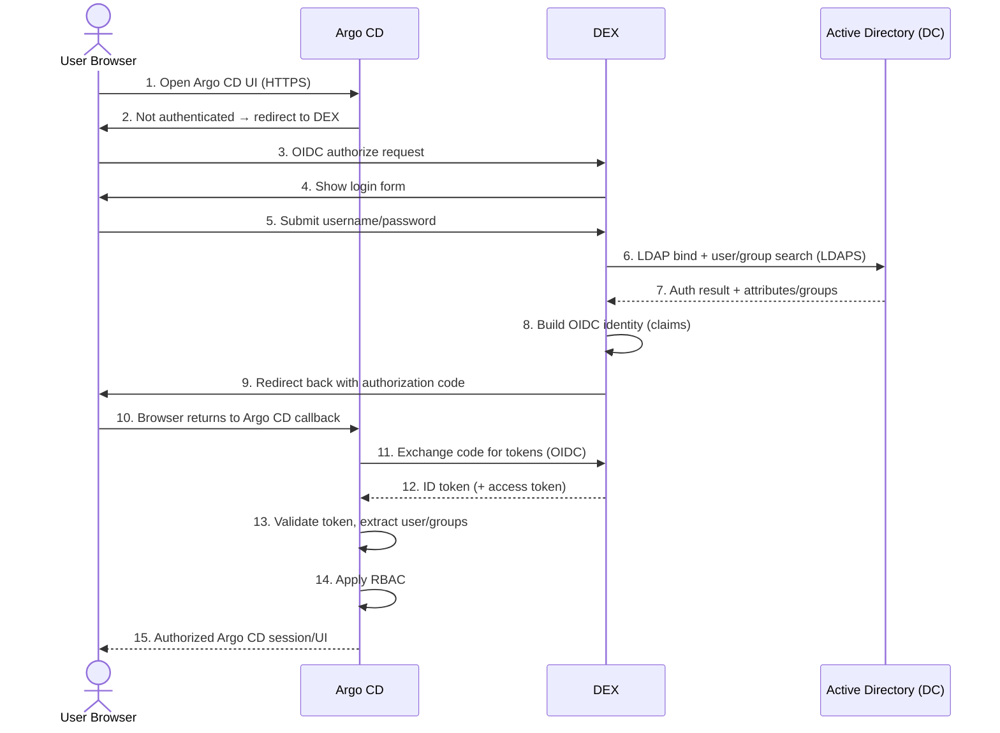
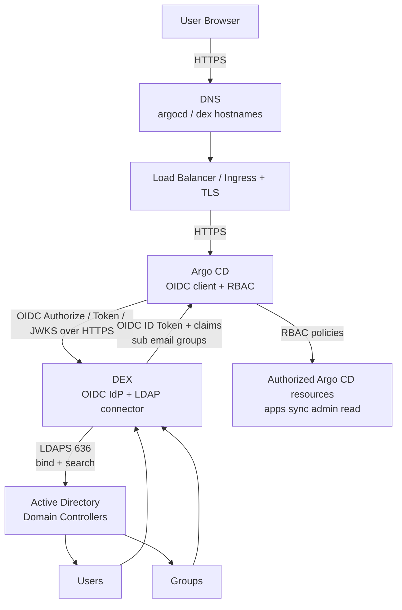

# Production Diagrams — AD + LDAP + DEX + Argo CD

Use this page as the reference for:

1. Production-style authentication sequence
2. Final comprehensive production diagram

---

## 1) Production-style sequence



### Step ownership

| Step | System | What happens |
|---|---|---|
| 1 | User | Opens Argo CD |
| 2 | Argo CD | Detects no session, redirects to DEX |
| 3–5 | DEX + User | OIDC login starts, credentials submitted |
| 6–7 | DEX + AD | LDAPS bind/search, credential verification |
| 8–9 | DEX | Creates OIDC identity, returns auth code |
| 10–12 | Argo CD + DEX | Token exchange over OIDC |
| 13–15 | Argo CD | Validate identity, apply RBAC, grant access |

---

## 2) Final comprehensive production diagram



### Protocol labels on the real path

| Connection | Protocol | Purpose |
|---|---|---|
| User ↔ Ingress / Argo CD | HTTPS | Open UI / API |
| Argo CD ↔ DEX | OIDC over HTTPS | Login redirect, token exchange, JWKS |
| DEX ↔ Active Directory | LDAP / LDAPS | Verify credentials, fetch users/groups |
| Inside Argo CD after login | RBAC | Decide what the user can do |

---

## 3) Compact production flow (quick reference)

```text
User Browser
   ↓ HTTPS
Ingress / Load Balancer
   ↓ HTTPS
Argo CD
   ↓ OIDC
DEX
   ↓ LDAPS
Active Directory
   ↓ user + group information
DEX
   ↓ OIDC ID token / claims
Argo CD
   ↓ RBAC
Authorized Argo CD resources
```

---

## 4) One-line memory

AD stores identity.  
LDAP queries identity.  
DEX translates identity.  
Argo CD consumes identity and enforces RBAC.
